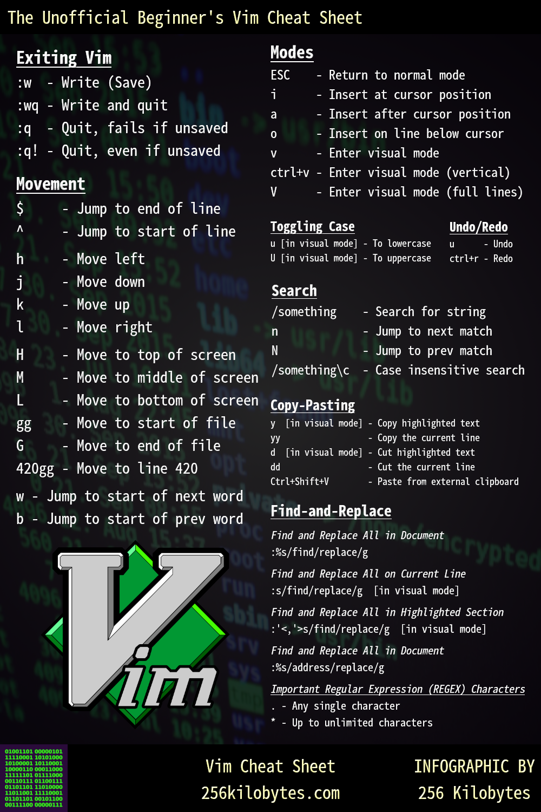
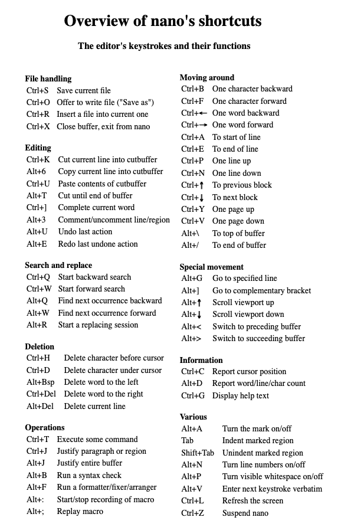

# GDB Debugger
```

GDB commands by function - simple guide
---------------------------------------
More important commands have a (*) by them.

Startup 
% gdb -help         	print startup help, show switches
*% gdb object      	normal debug 
*% gdb object core 	core debug (must specify core file)
%% gdb object pid  	attach to running process
% gdb        		use file command to load object 

Help
*(gdb) help        	list command classes
(gdb) help running      list commands in one command class
(gdb) help run        	bottom-level help for a command "run" 
(gdb) help info         list info commands (running program state)
(gdb) help info line    help for a particular info command
(gdb) help show         list show commands (gdb state)
(gdb) help show commands        specific help for a show command

Breakpoints
*(gdb) break main       set a breakpoint on a function
*(gdb) break 101        set a breakpoint on a line number
*(gdb) break basic.c:101        set breakpoint at file and line (or function)
*(gdb) info breakpoints        show breakpoints
*(gdb) delete 1         delete a breakpoint by number
(gdb) delete        	delete all breakpoints (prompted)
(gdb) clear             delete breakpoints at current line
(gdb) clear function    delete breakpoints at function
(gdb) clear line        delete breakpoints at line
(gdb) disable 2         turn a breakpoint off, but don't remove it
(gdb) enable 2          turn disabled breakpoint back on
(gdb) tbreak function|line        set a temporary breakpoint
(gdb) commands break-no ... end   set gdb commands with breakpoint
(gdb) ignore break-no count       ignore bpt N-1 times before activation
(gdb) condition break-no expression         break only if condition is true
(gdb) condition 2 i == 20         example: break on breakpoint 2 if i equals 20
(gdb) watch expression        set software watchpoint on variable
(gdb) info watchpoints        show current watchpoints

Running the program
*(gdb) run        	run the program with current arguments
*(gdb) run args redirection        run with args and redirection
(gdb) set args args...        set arguments for run 
(gdb) show args        show current arguments to run
*(gdb) cont            continue the program
*(gdb) step            single step the program; step into functions
(gdb) step count       singlestep \fIcount\fR times
*(gdb) next            step but step over functions 
(gdb) next count       next \fIcount\fR times
*(gdb) CTRL-C          actually SIGINT, stop execution of current program 
*(gdb) attach process-id        attach to running program
*(gdb) detach        detach from running program
*(gdb) finish        finish current function's execution
(gdb) kill           kill current executing program 

Stack backtrace
*(gdb) bt        	print stack backtrace
(gdb) frame        	show current execution position
(gdb) up        	move up stack trace  (towards main)
(gdb) down        	move down stack trace (away from main)
*(gdb) info locals      print automatic variables in frame
(gdb) info args         print function parameters 

Browsing source
*(gdb) list 101        	list 10 lines around line 101
*(gdb) list 1,10        list lines 1 to 10
*(gdb) list main  	list lines around function 
*(gdb) list basic.c:main        list from another file basic.c
*(gdb) list -        	list previous 10 lines
(gdb) list *0x22e4      list source at address
(gdb) cd dir        	change current directory to \fIdir\fR
(gdb) pwd          	print working directory
(gdb) search regexpr    forward current for regular expression
(gdb) reverse-search regexpr        backward search for regular expression
(gdb) dir dirname       add directory to source path
(gdb) dir        	reset source path to nothing
(gdb) show directories        show source path

Browsing Data
*(gdb) print expression        print expression, added to value history
*(gdb) print/x expressionR        print in hex
(gdb) print array[i]@count        artificial array - print array range
(gdb) print $        	print last value
(gdb) print *$->next    print thru list
(gdb) print $1        	print value 1 from value history
(gdb) print ::gx        force scope to be global
(gdb) print 'basic.c'::gx        global scope in named file (>=4.6)
(gdb) print/x &main     print address of function
(gdb) x/countFormatSize address        low-level examine command
(gdb) x/x &gx        	print gx in hex
(gdb) x/4wx &main       print 4 longs at start of \fImain\fR in hex
(gdb) x/gf &gd1         print double
(gdb) help x        	show formats for x
*(gdb) info locals      print local automatics only
(gdb) info functions regexp         print function names
(gdb) info variables  regexp        print global variable names
*(gdb) ptype name        print type definition
(gdb) whatis expression       print type of expression
*(gdb) set variable = expression        assign value
(gdb) display expression        display expression result at stop
(gdb) undisplay        delete displays
(gdb) info display     show displays
(gdb) show values      print value history (>= gdb 4.0)
(gdb) info history     print value history (gdb 3.5)

Object File manipulation
(gdb) file object      		load new file for debug (sym+exec)
(gdb) file             		discard sym+exec file info
(gdb) symbol-file object        load only symbol table
(gdb) exec-file object 		specify object to run (not sym-file)
(gdb) core-file core   		post-mortem debugging

Signal Control
(gdb) info signals        	print signal setup
(gdb) handle signo actions      set debugger actions for signal
(gdb) handle INT print          print message when signal occurs
(gdb) handle INT noprint        don't print message
(gdb) handle INT stop        	stop program when signal occurs
(gdb) handle INT nostop         don't stop program
(gdb) handle INT pass        	allow program to receive signal
(gdb) handle INT nopass         debugger catches signal; program doesn't
(gdb) signal signo        	continue and send signal to program
(gdb) signal 0        		continue and send no signal to program

Machine-level Debug
(gdb) info registers        	print registers sans floats
(gdb) info all-registers        print all registers
(gdb) print/x $pc        	print one register
(gdb) stepi        		single step at machine level
(gdb) si        		single step at machine level
(gdb) nexti        		single step (over functions) at machine level
(gdb) ni        		single step (over functions) at machine level
(gdb) display/i $pc        	print current instruction in display
(gdb) x/x &gx        		print variable gx in hex
(gdb) info line 22        	print addresses for object code for line 22
(gdb) info line *0x2c4e         print line number of object code at address
(gdb) x/10i main        	disassemble first 10 instructions in \fImain\fR
(gdb) disassemble addr          dissassemble code for function around addr

History Display
(gdb) show commands        	print command history (>= gdb 4.0)
(gdb) info editing       	print command history (gdb 3.5)
(gdb) ESC-CTRL-J        	switch to vi edit mode from emacs edit mode
(gdb) set history expansion on       turn on c-shell like history
(gdb) break class::member       set breakpoint on class member. may get menu
(gdb) list class::member        list member in class
(gdb) ptype class               print class members
(gdb) print *this        	print contents of this pointer
(gdb) rbreak regexpr     	useful for breakpoint on overloaded member name

Miscellaneous
(gdb) define command ... end        define user command
*(gdb) RETURN        		repeat last command
*(gdb) shell command args       execute shell command 
*(gdb) source file        	load gdb commands from file
*(gdb) quit        		quit gdb
```

# Editores



